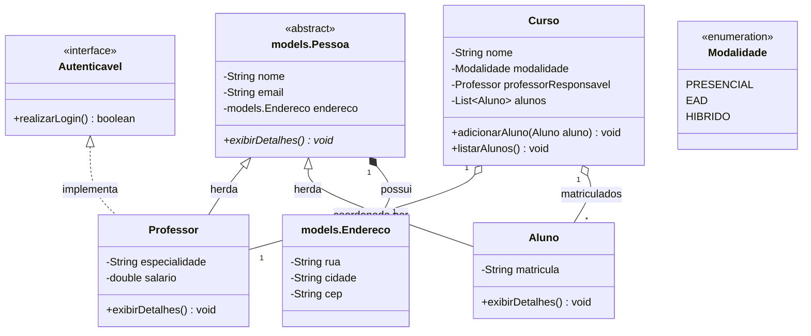

# 💻 Desafio Técnico: Programação Orientada a Objetos com Java

Bem-vindo(a) ao Desafio Prático de POO! 🚀

Este desafio tem como objetivo avaliar seus conhecimentos práticos em Programação Orientada a Objetos utilizando a linguagem Java. Você deverá modelar e implementar um mini-sistema de **Gestão Educacional** seguindo rigorosamente o Diagrama de Classes UML fornecido.

## 🎯 Objetivos de Aprendizagem
- Criar classes e instanciar objetos.
- Utilizar **Encapsulamento** (modificadores de acesso, getters e setters).
- Aplicar **Herança** (classes abstratas e concretas).
- Implementar **Interfaces** (contratos).
- Trabalhar com **Enums**.
- Estabelecer associações entre objetos (`1:1` e `1:N`).

---

## 🏗️ O Desafio (Modelagem do Domínio)

Você foi encarregado de construir o núcleo de classes de um sistema escolar. Abaixo está o Diagrama de Classes UML que ditará a arquitetura da sua implementação.

*Dica: Preste bastante atenção aos multiplicadores de associação, modificadores de acesso ( `+` public, `-` private ) e aos tipos das classes.*



### 📋 Requisitos de Implementação

1. **Enum** `Modalidade`: Deve conter as constantes `PRESENCIAL`, `EAD` e `HIBRIDO`.
2. **Interface** `Autenticavel`: Deve definir a assinatura do método `realizarLogin()`.
3. **Classe Abstrata** `models.Pessoa`:
* Deve conter os atributos encapsulados `nome`, `email` e um objeto `models.Endereco` (Associação 1:1).
* Deve possuir um método abstrato `exibirDetalhes()`.


4. **Classes** `Aluno` e `Professor`:
* Ambas devem herdar de `models.Pessoa` e implementar o método `exibirDetalhes()` com comportamentos específicos.
* Apenas o `Professor` deve implementar a interface `Autenticavel` (simulando um login com retorno `true` genérico).


5. **Classe** `Curso`:
* Deve conter uma Associação 1:1 com `Professor` (responsável pelo curso).
* Deve conter uma Associação 1:N com `Aluno` (lista de alunos matriculados).
* O método `adicionarAluno()` deve inserir o aluno na lista do curso.

---

## 🛠️ Passo a Passo para Entrega

Siga os passos abaixo para iniciar e entregar a sua solução:

### 1. Faça o Fork deste Repositório

No canto superior direito desta página, clique no botão **Fork**. Isso criará uma cópia deste repositório na sua própria conta do GitHub.

### 2. Clone o seu Repositório

Abra o seu terminal (ou Git Bash) e faça o clone do repositório que agora está na sua conta:

```bash
git clone https://github.com/SEU_USUARIO/desafio-tecnico-poo.git

```

### 3. Implemente a Solução

Abra o projeto na sua IDE favorita (IntelliJ, Eclipse, VS Code) e crie os pacotes e classes necessários.

* *Opcional (Extra): Crie uma classe `App` (se já não houver) com o método `main` para instanciar os objetos e testar se os relacionamentos estão funcionando no console.*

### 4. Faça o Commit e Push

Após finalizar e testar seu código, envie as alterações para o seu repositório no GitHub:

```bash
git add .
git commit -m "feat: implementa entidades e relacionamentos UML"
git push origin main

```

### 5. Abra o Pull Request (PR)

* Volte para a página do seu repositório no GitHub.
* Clique na aba **Pull Requests** e em seguida no botão **New pull request**.
* Certifique-se de que a `base repository` é o repositório original (o meu) e o `head repository` é o seu fork.
* Clique em **Create pull request**.

**⚠️ IMPORTANTE:** No menu lateral direito, na seção **Reviewers**, adicione o meu usuário **`@alexandresouzajr`** para que eu seja notificado e possa avaliar o seu código.

---

*Boa sorte! O foco deste desafio não é a lógica complexa, mas sim a correta estruturação e o uso adequado dos pilares da POO.* 👨‍💻👩‍💻
